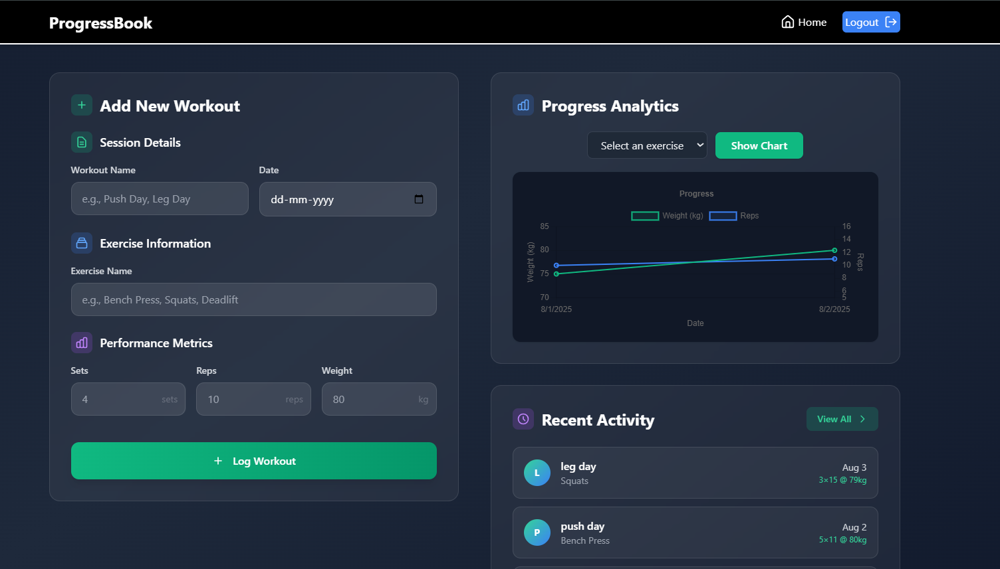

# 🏋️‍♂️ Workout Tracker

A full-stack web application for tracking and managing your workout routines with beautiful data visualizations and user authentication.



Experience : https://progressbook.onrender.com

## 🚀 Features

- **User Authentication**: Secure login and registration system with JWT tokens
- **Workout Management**: Add, view, and track your daily workouts
- **Data Visualization**: Interactive charts showing your workout progress
- **Responsive Design**: Beautiful UI with Tailwind CSS and glass morphism effects
- **Real-time Updates**: Live workout data tracking and history
- **Secure Sessions**: HTTP-only cookies for authentication

## 🛠️ Tech Stack

### Frontend
- **React.js** - User interface library
- **Vite** - Fast build tool and development server
- **Redux Toolkit** - State management
- **Tailwind CSS** - Utility-first CSS framework
- **Chart.js** - Data visualization library
- **Axios** - HTTP client for API requests

### Backend
- **Node.js** - JavaScript runtime
- **Express.js** - Web application framework
- **MongoDB Atlas** - Cloud database
- **Mongoose** - MongoDB object modeling
- **JWT** - JSON Web Tokens for authentication
- **bcryptjs** - Password hashing
- **CORS** - Cross-origin resource sharing

## 📁 Project Structure

```
WorkoutTracker-MINI-PJCT/
├── client/                 # Frontend React application
│   ├── public/
│   ├── src/
│   │   ├── components/     # Reusable UI components
│   │   ├── Pages/          # Application pages
│   │   ├── store/          # Redux store and slices
│   │   ├── utils/          # Utility functions
│   │   └── assets/         # Static assets
│   ├── package.json
│   └── vite.config.js
├── server/                 # Backend Express application
│   ├── src/
│   │   ├── controllers/    # Route controllers
│   │   ├── middlewares/    # Express middlewares
│   │   ├── models/         # MongoDB models
│   │   ├── routes/         # API routes
│   │   └── DB/            # Database configuration
│   ├── package.json
│   └── .env
└── package.json           # Root package.json
```

## ⚡ Quick Start

### Prerequisites
- Node.js (v14 or higher)
- npm or yarn
- MongoDB Atlas account

### Installation

1. **Clone the repository**
   ```bash
   git clone https://github.com/Abhi5hek-20/WorkoutTracker.git
   cd WorkoutTracker-MINI-PJCT
   ```

2. **Install dependencies**
   ```bash
   # Install server dependencies
   cd server
   npm install
   
   # Install client dependencies
   cd ../client
   npm install
   ```

3. **Environment Setup**
   
   Create a `.env` file in the `server` directory:
   ```env
   PORT=8080
   JWT_SECRET=your_jwt_secret_here
   MONGO_URL=your_mongodb_connection_string_here
   ```

4. **Start the application**
   
   **Option 1: Run separately**
   ```bash
   # Terminal 1 - Start backend server
   cd server
   npm start
   
   # Terminal 2 - Start frontend client
   cd client
   npm start
   ```
   
   **Option 2: Run from root (production build)**
   ```bash
   # From project root
   npm start
   ```

5. **Access the application**
   - Frontend: `http://localhost:3000`
   - Backend API: `http://localhost:8080`

## 📊 API Endpoints

### Authentication
- `POST /wt/auth/signup` - User registration
- `POST /wt/auth/login` - User login
- `POST /wt/auth/logout` - User logout
- `GET /wt/auth/check-auth` - Check authentication status

### Workouts
- `GET /wt/workouts` - Get user workouts
- `POST /wt/workouts` - Add new workout
- `PUT /wt/workouts/:id` - Update workout
- `DELETE /wt/workouts/:id` - Delete workout

## 🎨 UI Components

- **Navbar** - Navigation with authentication status
- **HomePage** - Dashboard with animated background and workout overview
- **InputForm** - Add new workout entries
- **WorkoutChart** - Data visualization of workout progress
- **WorkoutHistory** - List of past workouts
- **LoginPage/SignUpPage** - Authentication forms
- **ProtectedRoute** - Route protection for authenticated users

## 🔧 Configuration

### Frontend Configuration
- **Vite Config**: Configured for port 3000
- **Tailwind**: Custom animations and glass morphism effects
- **Redux Store**: Centralized state management for users and workouts

### Backend Configuration
- **CORS**: Configured for localhost:3000 and localhost:5173
- **JWT**: 1-hour token expiration
- **Cookies**: HTTP-only, secure settings for production
- **Database**: MongoDB Atlas with Mongoose ODM

## 🚀 Deployment

The application is configured for deployment on various platforms:

### Build for Production
```bash
npm run build
```

This command will:
1. Install all dependencies
2. Build the client for production
3. Copy built files to server/public directory

### Environment Variables for Production
```env
NODE_ENV=production
JWT_SECRET=your_production_jwt_secret
MONGO_URL=your_production_mongodb_url
FRONTEND_URL=your_production_frontend_url
```

## 🤝 Contributing

1. Fork the repository
2. Create your feature branch (`git checkout -b feature/AmazingFeature`)
3. Commit your changes (`git commit -m 'Add some AmazingFeature'`)
4. Push to the branch (`git push origin feature/AmazingFeature`)
5. Open a Pull Request

## 📝 License

This project is licensed under the ISC License.

## 👨‍💻 Author

**Abhi5hek-20**
- GitHub: [@Abhi5hek-20](https://github.com/Abhi5hek-20)
- Project: [WorkoutTracker](https://github.com/Abhi5hek-20/WorkoutTracker)

## 🙏 Acknowledgments

- Thanks to Mummadi Adarsh chary who helped me make this project better
- Inspired by the need for a simple, effective workout tracking solution
- Built with modern web technologies for optimal performance

---

**Happy Tracking! 💪**
